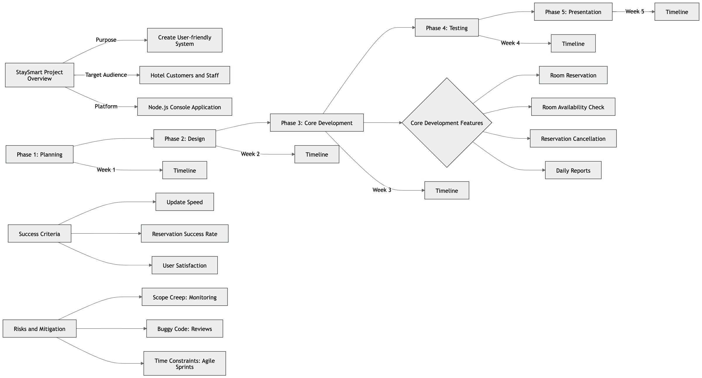

# Teamwork 5 DevOps

e2305307  Husnain Ahmad,
e2302312  Muhammad Usama Amir
e2301477  Lien Nguyen

### **Project Plan: Hotel Room Reservation Application**

### **1. Project Overview**

- **Project Name**: StaySmart
- **Purpose**: Create a simple, user-friendly system that allows customers to manage hotel room reservations with ease. This will also provide hotel staff a tool to streamline room management and booking tasks effciently.
- **Scope**: Initial development will focus on a console-based backend application, with potential future expansion into a web or mobile interface. The application could also integrate with payment gateways and offer advanced reporting features.
- **Development Approach**:  The initial version will be developed as a backend application using Node.js. In future iterations, it can be integrated into a web-based front-end (using technologies like Express, React, or Angular) or mobile applications. Database management will use either MongoDB for scalability, with potential migration to cloud platforms like Azure

### **2. Objectives**

- Implement a system where customers can:
    - Check real-time room availability based on date ranges.
    - Find best options according to their requirments.
    - Booking and cancellation features.
- Provide hotel staff the ability to:
    - View current room availability and customer details.
    - Update room statuses (vacant, reserved, occupied).
    - Generate and view daily, weekly, and monthly booking reports.

### **3. Project Deliverables**

- **Functional Application**: A fully operational Node.js backend application with APIs to handle room availability, reservations, and staff management.
- **Documentation**: Detailed explanation of code, how the system works, and the final report.
- **Presentation**: Final presentation showing the functionality, code structure of the system.

### **4. Major Milestones**

| Milestone | Description | Completion Date |
| --- | --- | --- |
| **Project Planning** | Defining scope, objectives, and technology stack. | Week 1 |
| **Design Phase** | Define system architecture, objects, and functions. | Week 2/3 |
| **Development Phase** | Implement core features (API routes, database models, services) | Week 4/5 |
| **Testing Phase** | Test core functions, fix bugs, and refine system. | Week 6 |
| **Documentation & Presentation** | Prepare final project documentation and presentation. | Week 7 |

### **5. Roles and Responsibilities**

- **Project Manager**: Coordinates the team and oversees progress (Your role or group leader).
- **Developers**:  Design and implement API routes, database models, and services (Team members).
- **Tester**: Ensures all features work as expected through unit, integration testing (Everyone in the team).

### **6. Development Tools and Technologies**

- **Programming Language**: Node.js
- **Framework**: Express.js for backend API development.
- **Development Environment**: Visual Studio Code.
- **Data Storage**: MongoDB to store room and customer information.
- **Testing Tools**: Console testing, manual validation of functionality.

### **7. Risk Management**

| Risk | Impact | Mitigation Strategy |
| --- | --- | --- |
| **Scope Creep** | Delays project delivery. | Keep scope simple and focused on essential features. |
| **Buggy Code** | Reduces user experience. | Regular testing after each task. |
| **Time Constraints** | Project not completed on time. | Stick to the timeline, track progress regularly. |

### **8. Testing Plan**

- **Unit Testing**: Test individual functions (e.g., room booking, room availability checking).
- **Integration Testing**: Ensure database operations and API endpoints work together.
- **User Acceptance Testing (UAT):** Conduct final tests with potential users to gather feedback and ensure usability.

### **9. Timeline**

| Task | Duration | Responsible |
| --- | --- | --- |
| **Project Planning** | 1 week | Project Manager |
| **System Design** | 2 week | Developers |
| **Core Development** | 2 week | Developers |
| **Testing & Refining** | 1 week | Developers, Tester |
| **Final Presentation** | 1 week | Entire Team |

### **10. Project Plan Diagram**

### **Conclusion**

SmartStay aims to revolutionise the hotel booking experience by integrating intelligent features that cater to user preferences and enhance operational efficiency for hotels. This concept allows for extensive expansion in the future, with possibilities for mobile app development or making it a smart choice for hotels looking for flexibility.

